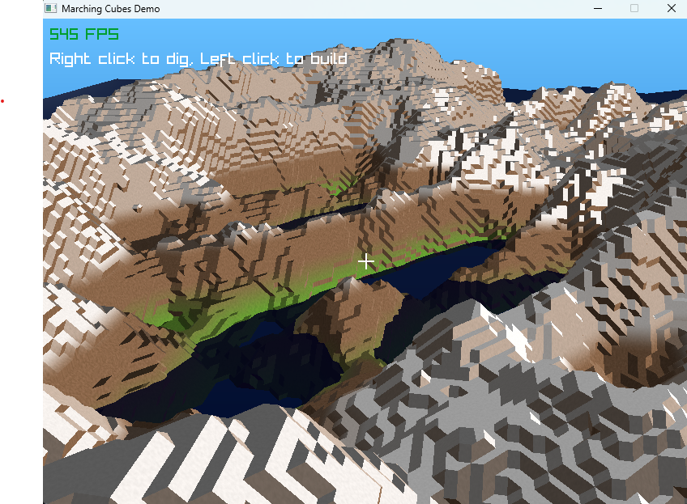

# Raym - Interactive Terrain Generation with Marching Cubes

A real-time interactive terrain generation and modification system built with C and Raylib, implementing the Marching Cubes algorithm for smooth voxel-based terrain.



## Features

- Real-time terrain generation using Marching Cubes algorithm
- Interactive terrain modification (add/remove terrain)
- Smooth camera controls for easy navigation
- Dynamic mesh generation and updating
- Modern shader-based rendering with normal mapping
- Water rendering with reflections and distortions
- Efficient chunk-based terrain system

## Prerequisites

- CMake (3.0 or higher)
- C compiler (GCC, Clang, or MSVC)
- Raylib dependencies (automatically handled by CMake)

## Building the Project

1. Clone the repository:
```bash
git clone https://github.com/yourusername/raym.git
cd raym
```

2. Create and navigate to the build directory:
```bash
mkdir build
cd build
```

3. Generate build files and compile:
```bash
cmake ..
cmake --build .
```

## Controls

- **WASD** - Move camera
- **Mouse** - Look around
- **Left Click** - Add terrain
- **Right Click** - Remove terrain
- **Shift** - Speed up camera movement
- **ESC** - Exit

## Project Structure

- `src/` - Source code files
  - `main.c` - Program entry point and main loop
  - `marching_cubes.c` - Marching cubes implementation
  - `terrain.c` - Terrain generation and modification
  - `render.c` - Rendering system
- `resources/` - Shaders, textures, and other assets
- `include/` - Header files
- `scripts/` - Build and utility scripts

## Technical Details

The project uses a chunk-based system for terrain management, where each chunk contains a grid of density values. The Marching Cubes algorithm is used to generate mesh geometry from these density values, creating smooth terrain surfaces. Real-time modification is achieved through density field manipulation and efficient mesh updating.

## Acknowledgments

- Raylib - for providing an excellent graphics framework
- Paul Bourke - for the original Marching Cubes implementation reference.